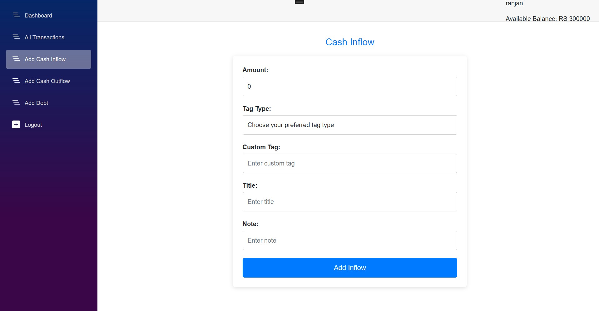

# 💰 SpendWise: Your Personal Finance Companion

Welcome to **SpendWise**, a sleek desktop application crafted to simplify personal finance management.  
Built with **.NET MAUI** and **Blazor Hybrid**, SpendWise empowers users to track income, expenses, and debts with intuitive tools and real-time insights — bringing clarity to your financial journey.

---

## 🌟 Overview

SpendWise is designed to make budgeting effortless and insightful.  

### Key Features:
- 📈 **Track Transactions** – Monitor cash inflows, outflows, and debts seamlessly.
- ⚠️ **Balance Alerts** – Prevent overspending with sufficient balance checks.
- 🏷️ **Custom Tags** – Organize transactions with personalized labels and notes.
- 🔎 **Smart Search** – Filter and sort transactions by type, date, or title.
- 📊 **Insightful Dashboard** – Visualize top transactions and pending debts.

---

## 🎯 Purpose & Audience

- **Purpose:** To provide a user-friendly platform for managing personal finances with precision and ease.  
- **Target Audience:** Budget-conscious individuals, freelancers, students, and anyone seeking financial control and clarity.

---

## 🛠️ Technologies Used

- **.NET 8.0** – Robust framework for cross-platform development.
- **C#** – Core logic for reliable and scalable performance.
- **MAUI Blazor Hybrid** – Native desktop UI with web technologies (HTML/CSS).
- **CSS** – Modern, responsive styling for a polished interface.

---

## 📷 Preview

### 📊 Dashboard  
View your financial overview with top transactions and pending debts.  


### 💸 All Transactions  
Add inflows, outflows, and debts with ease.  


### 🔍 Add Cash  
Quickly add Inflow, Outflow, and Debt.  


---


## 🚀 Installation & Setup

To run **SpendWise** locally:

```bash
git clone https://github.com/ranjan-uprety/SpendWise.git
cd SpendWise

```

# Open in Visual Studio, build, and run
Open SpendWise.sln in Visual Studio.

Build and run the project to start managing your finances!


## 🙌 Contributions
SpendWise is a personal project to explore .NET MAUI development.
Contributions, ideas, or bug reports are welcome via pull requests or issues on GitHub.

## 📧 Contact

Created by [Ranjan Uprety](https://www.linkedin.com/in/ranjan-uprety/) – feel free to reach out for feedback or collaboration ideas!


